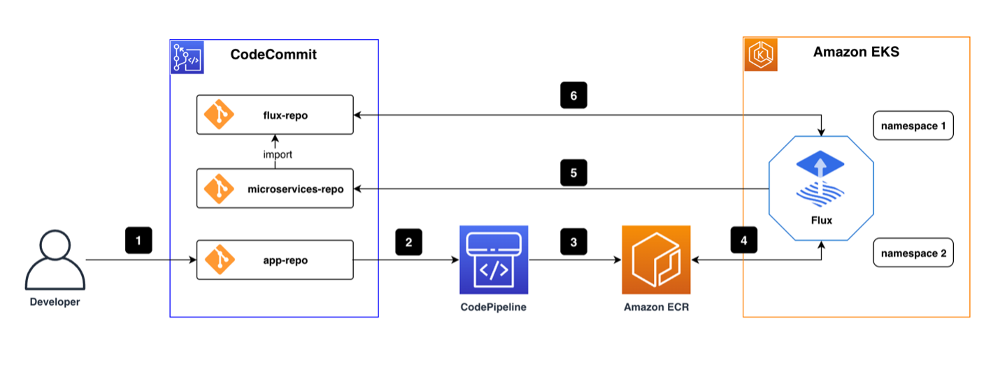

# Practical of GitOps Based on Flux CD

The overall CI/CD pipeline, according to best practices, is shown in the figure below.

There are three code repositories under the CodeCommit repository. One is `flux-repo`, the configuration repository for [Flux CD](https://fluxcd.io/), which is used to define Flux-related resources. The other is [microservices-repo](https://github.com/microservices-demo/microservices-demo), which saves microservice application configurations and deployment files. The third one is the source repository `app-repo` for business services. In this post, a [front-end](https://github.com/microservices-demo/front-end) project will be used as an example. We used CodePipeline for continuous integration in the CI/CD pipeline, built and stored the docker image in Amazon ECR, and deployed the CD engine Flux as a pod in the Amazon EKS environment.

**The basic workflow is:**

1. Coding engineers write code and push the final code to app-repo.
2. Code changes in the app-repo trigger AWS CodePipeline.
3. AWS CodePipeline edits and packages code, generates container images, and pushes them to the container image repository/Amazon ECR.
4. The CD engine Flux, running in the EKS environment, regularly scans the ECR container image repository and pulls container image metadata for applications.
5. The new container image address is automatically synced to the application deployment file stored in microservices-repo via git commit/push when a new version of the container image detected.
6. Flux regularly pulls application configurations and deployment files from the Flux-repo. Since the Flux-repo repository references the microservices-repo, Flux checks the consistency of the workload running state of the cluster with the expectations described in the microservices-repo files. If there is any difference, Flux will automatically enable the EKS cluster to synchronize the differences to ensure that workloads run in the expected state.

**Table of Best Practices**

Since we have explained the GitOps concept and the architecture of the CI/CD pipeline, we will use a case to complete this practice by going through the four modules below:

1. Deploy the cloud infrastructure using Infrastructure as Code (IaC)
2. Deploy Flux CD on AWS EKS cluster
3. Deploy GitOps workflow using Flux CD
4. Implement automatic deployment based on images using GitOps workflow
